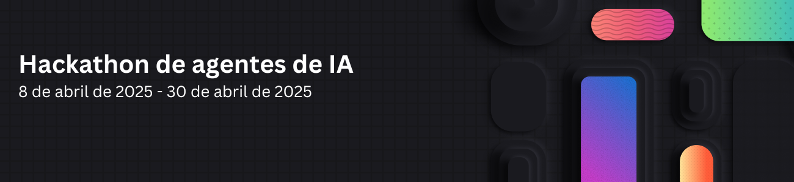

---
hide:
  - navigation
---

# 

🛠️ ¡Crea, innova y #HackeamosJuntos! 🛠️

¡2025 es el año de los AI agentes! Pero, ¿qué exactamente es un agente y cómo puedes crear uno? No importa si ya tienes experiencia o si recién estás empezando, este **hackathon virtual, TOTALMENTE GRATIS**, es tu chance para sumergirte en el desarrollo de agentes de IA.

🔥 Aprende de **más de 20 sesiones dirigidas por expertos** transmitidas en vivo en YouTube, cubriendo los frameworks principales como **Semantic Kernel**, **Autogen**, el nuevo **Azure AI Agents SDK** y el **Microsoft 365 Agents SDK**.

💡 Obtén experiencia práctica, desata tu creatividad y construye potentes agentes de IA. Luego, envía tu proyecto para tener la oportunidad de ganar **premios increíbles.** 💸

!!! tip "Fechas clave:"

    * Sesiones con expertos: **8 de abril de 2025 – 30 de abril de 2025**
    * Fecha límite para envíar proyectos: **30 de abril de 2025, 11:59 PM PST**

¡No te lo pierdas! Únete y comienza a construir el futuro de la IA. 🔥

## Registro 🎟️

[¡Regístrate ahora!](https://developer.microsoft.com/reactor/events/25323/) El formulario te inscribirá en el hackathon. Luego, explora el calendario de transmisiones en vivo a continuación y regístrate en las sesiones que te interesen.

Una vez registrado, [preséntate](https://github.com/microsoft/AI_Agents_Hackathon/discussions/5) y [busca compañeros para tu equipo](https://github.com/microsoft/AI_Agents_Hackathon/discussions/4).

## Envío de Proyectos 🚀

Revisa las [reglas oficiales](rules.md) y asegúrate de entender los requisitos.

Una vez que tu proyecto esté listo, sigue el [proceso de envío](submission.md). 📝

## Premios y Categorías 🏅

Los proyectos serán evaluados por un panel de jueces, que incluye ingenieros de Microsoft, gerentes de producto y developer advocates. Los criterios de evaluación incluirán innovación, impacto, usabilidad técnica y alineación con la categoría correspondiente del hackathon.

Cada equipo ganador en las categorías a continuación recibirá un premio. 💸

* Mejor Agente en General - $20,000
* Mejor Agente en Python - $5,000
* Mejor Agente en C# - $5,000
* Mejor Agente en Java - $5,000
* Mejor Agente en JavaScript/TypeScript - $5,000
* Mejor Agente Copilot (usando Microsoft Copilot Studio o Microsoft 365 Agents SDK) - $5,000
* Mejor Uso del Servicio de Agentes de Azure AI - $5,000

Cada equipo solo puede ganar en una categoría.  
Todos los participantes que envíen un proyecto recibirán una insignia digital.

## Calendario de transmisiones 📅

### Español

[Regístrate para todas las sesiones en español](https://developer.microsoft.com/reactor/series/S-1512/)

¡Si estás buscando los recursos mostrados en cualquiera de las sesiones, [puedes encontrarlos aquí!](https://github.com/microsoft/AI_Agents_Hackathon/discussions/59)

| Día/Hora              | Tema                    | Pista                    |
| --------------------- | ------------------------ | ------------------------ |
| 4/8 12:00 PM PT | [Bienvenidos al Hackathon de Agentes de IA](https://developer.microsoft.com/reactor/events/25341) | Todas |
| 4/16 09:00 AM PT    | [Crea tu aplicación de código con Azure AI Agent Service](https://developer.microsoft.com/reactor/events/25360) | Python |
| 4/16 12:00 PM PT | [Agentes de IA + .NET Aspire](https://developer.microsoft.com/reactor/events/25333) | C# |
| 4/17 12:00 PM PT | [Crea aplicaciones de agentes de IA con Semantic Kernel](https://developer.microsoft.com/reactor/events/25340/) | Python |
| 4/22 12:00 PM PT | [Prototipando agentes de IA con GitHub Models](https://developer.microsoft.com/reactor/events/25483/) | Python |
| 4/23 03:00 PM PT | [VoiceRAG: habla con tus datos](https://developer.microsoft.com/reactor/events/25485/) | Python |

### Otros Idiomas

Tendremos más de 30 transmisiones en inglés, además de transmisiones en español y chino. Consulta la [página principal](/AI_Agents_Hackathon/) para más detalles.

## Horas de Oficina 🕒

Si necesitas ayuda adicional con tus proyectos, puedes unirte a las Horas de Oficina en nuestro Discord.

Al momento, este es el horario:

| Día/Hora              | Tema/Anfitriones                         |
| --------------------- | ---------------------------------------- |
| Todos los lunes, 03:00 PM PT | [Python + AI (Español)](https://aka.ms/pythonia/oh)
| Todos los jueves, 01:00 PM PT | [Python + AI (Inglés)](http://aka.ms/aipython/oh)

## Ejemplos de código

Una de las mejores maneras de comenzar con los agentes de IA es usar [GitHub Models](https://github.com/marketplace/models), ya que permite a cualquier persona con una cuenta de GitHub usar potentes LLM gratuitos.

Consulta el siguiente repositorio para ver cómo usar los frameworks de agentes de IA de Python más populares con GitHub Models:
[https://github.com/Azure-Samples/python-ai-agent-frameworks-demos](https://github.com/Azure-Samples/python-ai-agent-frameworks-demos)

Además, todos los ponentes compartirán ejemplos de programación durante sus sesiones para explicar sus temas.

Ten en cuenta que Azure OpenAI, Azure AI Models y Azure AI Agents son servicios de pago, por lo que necesitarás una suscripción a Azure para usarlos. Consejos para minimizar costos al usar Azure:

* [Prueba gratuita de Azure](https://azure.microsoft.com/pricing/purchase-options/azure-account): Los programadores que son nuevos en Azure pueden registrarse para una prueba gratuita que incluye $200USD en créditos para utilizar en la plataforma durante los primeros 30 días.

* [Azure para estudiantes](https://azure.microsoft.com/free/students)
* [Servicios gratuitos](https://azure.microsoft.com/pricing/free-services/): Muchos servicios de Azure ofrecen planes gratuitos que permiten usar una cantidad limitada de recursos sin costo alguno.

**No ofrecemos créditos gratuitos para este hackathon,** por lo que deberás usar las opciones anteriores para minimizar costos.

## Recursos de Aprendizaje 📚

[Accede a los recursos aquí!](https://aka.ms/AIAgent_Skilling)

Únete a [TheSource EHub](https://aka.ms/thesource/ai_agents) para explorar nuestras mejores selecciones de capacitaciones, transmisiones en vivo, repositorios, guías técnicas, blogs, descargas, certificaciones y más, todo actualizado mensualmente. La sección de Agentes de IA ofrece recursos esenciales para crear Agentes de IA, mientras que otras secciones brindan información sobre IA, herramientas de desarrollo y lenguajes de programación.

También puedes publicar preguntas en nuestro [foro de discusión](https://github.com/microsoft/AI_Agents_Hackathon/discussions), o chatear con otros participantes en el [Discord](https://discord.gg/ZkEG5GYfGU).
